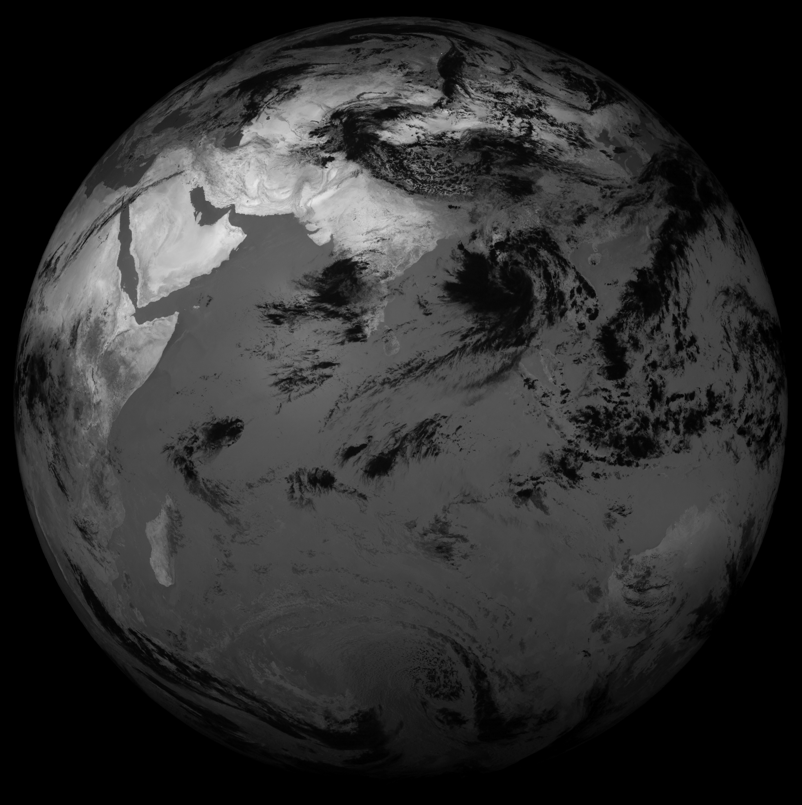
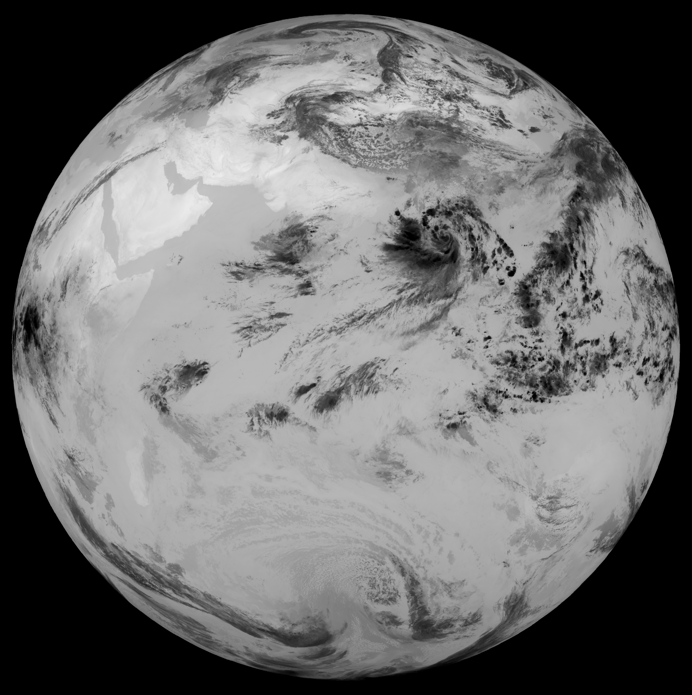

# Insatinator

Process INSAT-3D imagery
```
1. Create an account at https://www.mosdac.gov.in/
2. Wait for the account created Email
3. Go to mosdac website and click "Forgot Password"
4. Wait for password reset email, reset password and login
5. Click confirm email. Wait for confirmation email.
6. You may be asked to reset your password once again. Do it.
7. Finally log-in to Mosdac
8. Go to Order > Archived Data > Satellite
9. Select INSAT-3D and Imager for Datasource and Category
10. Select `3DIMG_L1B_STD`
11. Set Start Date to whenever you want data from.
12. Set End Date to 4 days before today.
13. Set Format HDF
14. Choose your bands. I chose all bands, but that creates Huge files.
15. Media is "products only"
16. Add to cart. You don't have to pay for it.
17. Wait for a few minutes and go to Status > Archived Request
18. Click the download button and select your files.
19. You can also download the files via their ftp server at sftp://mosdac.gov.in
20. Copy the .h5 HDF files to raw_data folder
```

Install dependencies listed in the pyproject.toml file. You should also install `scikit-image` -- although that package's install usually only works with anaconda/miniconda. I plan to removing the `scikit-image` dependency later.

From the root directory of this repo,

1. Run `insatinator/pre-process.py`, it reads the .h5 files and creates intermediate Numpy files.
2. Run `insatinator/mono.py` to generate Monocolour images for each of the bands
3. Run `insatinator/rgb.py` to generate the colour composite.


Alright, here's some strategy. First, order only a few samples of data and figure out which channels you need.
Choose only those channels when ordering more samples and save on data you have to download.

But it's still likely going to be a lot of data. 

Create a Digital Ocean droplet. Inbound data to their droplets is free.
Use aria2c to download a few samples of data from FTP at a time. Process it.
And delete the raw data and the intermediate files. Repeat till you've 
processed all your data. Now download the images, which are much much
smaller than the raw data.

Mosdac's FTP server is at `sftp://mosdac.gov.in`. 
But also at `sftp://ftp.mosdac.gov.in`. Both the
domains resolve to the same IP. Username and password
is same as the website's username and password.


## Sample Images



